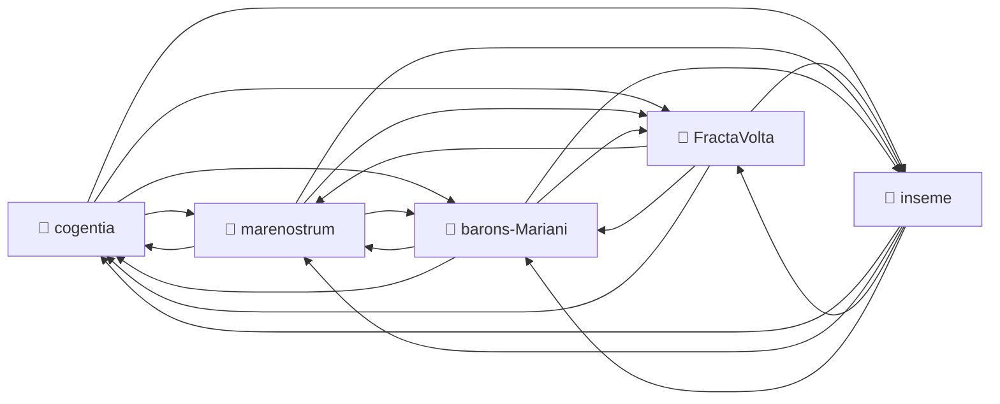

# Corpus Status — marenostrum

*Auto-refreshed by `cogentia.js corpus-status`. The structural sections* —
*Registered Repositories, Cross-Reference Graph, Published, What Remains Possible* —
*are regenerated from the registry and from `research/index.md` on every run.*
*The substantive sections* — *What Is Proved* *and* *Open Objections* —
*are manually curated and preserved across refreshes.*

---

## Registered Repositories

<!-- BEGIN_AUTO: registered_repos -->
| Repository | research/index.md | Branch | Last commit |
|---|---|---|---|
| cogentia | ✅ | main | 2026-05-15 |
| FractaVolta | ✅ | main | 2026-05-15 |
| marenostrum | ✅ | main | 2026-05-15 |
| barons-Mariani | ✅ | main | 2026-05-15 |
| inseme | ✅ | main | 2026-05-15 |
<!-- END_AUTO: registered_repos -->

---

## Cross-Reference Graph

<!-- BEGIN_AUTO: graph -->

<!-- END_AUTO: graph -->

---

## Concepts

<!-- BEGIN_AUTO: concepts -->
| Concept | Scope | Status | Type |
|---|---|---|---|
| [Cogentia](./concepts.md#cogentia) | Global | Working | abstract concept / agentivity class |
| [Cogentigram](./concepts.md#cogentigram) | Global | Working | representation / map |
| [DHITL (Democratic Human In The Loop)](./concepts.md#dhitl-democratic-human-in-the-loop) | Global | Canonical | anti-capture axiom |
| [CXU (Compute and Exergy Unit)](./concepts.md#cxu-compute-and-exergy-unit) | Global | Defined | metric |
| [Safe Compute Exergy](./concepts.md#safe-compute-exergy) | Global | Defined | governance paradigm |
| [Constellia](./concepts.md#constellia) | Global | Working | network architecture |
| [Corsica Forest Synergies](./concepts.md#corsica-forest-synergies) | project-specific | Working | ecological integration |
| [Infrastructure is All You Need](./concepts.md#infrastructure-is-all-you-need) | Global | Canonical | strategic doctrine |
| [Sun to Sovereignty](./concepts.md#sun-to-sovereignty) | project-specific | Defined | strategic pipeline |
<!-- END_AUTO: concepts -->

## Concept Graph

```mermaid
graph LR
  c_cogentia["Cogentia"]
  c_cogentigram["Cogentigram"]
  c_continuation_protocol["Continuation Protocol"]
  c_cogentia_commons["Cogentia Commons"]
  c_sovereign_digital_twin["Sovereign Digital Twin"]
  c_agent_resumable_cli["Agent-Resumable CLI"]
  c_kernel_extractor["Kernel Extractor"]
  c_kys_know_your_system_psychocognitive_analysis["KYS (Know Your System) / Psychocognitive Analysis"]
  c_cogentia_workflows["Cogentia Workflows"]
  c_cogentia["Cogentia"]
  c_cogentigram["Cogentigram"]
  c_ipn_inference_packet_network["IPN (Inference Packet Network)"]
  c_epn_energy_packet_network["EPN (Energy Packet Network)"]
  c_pgn_power_generation_node["PGN (Power Generation Node)"]
  c_packet_attractors["Packet Attractors"]
  c_the_unconscious_grid["The Unconscious Grid"]
  c_mariani_village["Mariani Village"]
  c_value_shaped_solar["Value-Shaped Solar"]
  c_containerized_compute_tera["Containerized Compute (Tera)"]
  c_traceable_governance["Traceable Governance"]
  c_cogentia["Cogentia"]
  c_cogentigram["Cogentigram"]
  c_dhitl_democratic_human_in_the_loop["DHITL (Democratic Human In The Loop)"]
  c_cxu_compute_and_exergy_unit["CXU (Compute and Exergy Unit)"]
  c_safe_compute_exergy["Safe Compute Exergy"]
  c_constellia["Constellia"]
  c_corsica_forest_synergies["Corsica Forest Synergies"]
  c_infrastructure_is_all_you_need["Infrastructure is All You Need"]
  c_sun_to_sovereignty["Sun to Sovereignty"]
  c_cogentia["Cogentia"]
  c_cogentigram["Cogentigram"]
  c_potentics["Potentics"]
  c_cognitive_waves["Cognitive Waves"]
  c_mimetic_desynchronization["Mimetic Desynchronization"]
  c_invidia["Invidia"]
  c_transition_markets["Transition Markets"]
  c_the_uchronian_museum["The Uchronian Museum"]
  c_possibilism["Possibilism"]
  c_territoires_possibilistes["Territoires Possibilistes"]
  c_the_second_method["The Second Method"]
  c_projet_minesteggio["Projet Minesteggio"]
  c_discret_holography["Discret Holography"]
  c_cogentia["Cogentia"]
  c_cogentigram["Cogentigram"]
  c_cop_continuous_operation_protocol["COP (Continuous Operation Protocol)"]
  c_briques["Briques"]
  c_kudocracy["Kudocracy"]
  c_agora["Agora"]
  c_ophelia["Ophélia"]
  c_cop_invariants["COP Invariants"]
  c_brique_spec_multi_instance["Brique Spec / Multi-Instance"]
  c_modular_system["Modular System"]
  c_traceable_agency["traceable agency"]
  c_traceable_agency --> c_cogentia
  c_cogentia --> c_cogentigram
  c_operational_memory["operational memory"]
  c_cogentia --> c_operational_memory
  c_map_vs_territory["map vs territory"]
  c_cogentigram -.-> c_map_vs_territory
  c_cogentigram -.-> c_operational_memory
  c_cogentigram -.-> c_traceable_agency
  c_agent_resumable_cli --> c_continuation_protocol
  c_dhitl["dhitl"]
  c_dhitl --> c_infrastructure_is_all_you_need
```

<!-- BEGIN_AUTO: concept_graph -->

<!-- END_AUTO: concept_graph -->

---

## Published in this repo

<!-- BEGIN_AUTO: published -->
| Title | Location | Date |
|---|---|---|
| [DHITL — Democratic Humans in the Loop](../DHITL.md) | this repo | 2026 |
| [CXU Specification](../CXU_SPEC.md) | this repo | 2026 |
| [Constellia](../constellia.md) *(ICOME'26, avec Guillermo Valdes)* | this repo | 2026 |
| [Infrastructure Is All You Need — Structural Theory of AI Safety](../infrastructure_is_all_you_need.md) | this repo | 2026-05-08 |
| [Safe Compute Exergy (SCE)](../safe_compute_exergy.md) | this repo | 2026-05-08 |
| [Compute Exergy as an Omitted Variable in AI Governance — Extending Harari's Nexus](../compute-exergy-omitted-variable.md) | this repo | 2026-05-08 |
| [Toward Empirical Validation of Infrastructure Topologies for Compute Sovereignty](../infrastructure_topologies_for_compute_sovereignty.md) | this repo | 2026-05-08 |
| [From Photons to Inferences — LessWrong post on SCE + topology](../lesswrong_post.md) | this repo | 2026-05-08 |
| [Mare Nostrum — Energy Sovereignty as Democratic Commons (Policy Paper)](../POLICY_PAPER.md) | this repo | 2026-05-08 |
| [From Sun to Sovereignty — Communal Sovereign Funds vs Land Dispossession](../PAPER_SUN_TO_SOVEREIGNTY.md) | this repo | 2026-05-08 |
| [Valorisation synergétique de la forêt corse (FR)](../corsica_forest_synergies.md) | this repo | 2026-05-08 |
| [EDF, Solaire et ZNI — Anatomie d'une captation de ressource (FR, v4.0)](../EDF.md) | this repo | 2026-05 |
| [Architecture](../ARCHITECTURE.md) | this repo | 2025–2026 |
| [Governance](../GOVERNANCE.md) | this repo | 2025–2026 |
| [Model](../MODEL.md) | this repo | 2025–2026 |
| [Contracts](../CONTRACTS.md) | this repo | 2025–2026 |
| [Pricing](../PRICING.md) | this repo | 2025–2026 |
| [Corpus Status](corpus-status.md) *(living view — auto-refreshed by `cogentia.js corpus-status`)* | this repo | refreshable |
| [Concept Index](concepts.md) *(typed concept registry — mapped by `cogentia.js concepts`)* | this repo | refreshable |
<!-- END_AUTO: published -->

---

## What Is Proved

*Manually curated: claims demonstrated by the published work in this corpus.*

| Claim | Status | Evidence |
|---|---|---|
| _(add claims here)_ | | |

---

## Open Objections

*Manually curated: objections received publicly, not yet fully resolved.*

| Objection | Source | Status |
|---|---|---|
| _(add objections here)_ | | |

---

## What Remains Possible

<!-- BEGIN_AUTO: possibilities -->
- Rencontres de Corte sur la Gouvernance des Infrastructures IA en Méditerranée (ICOME'26 week)
- CECA 1951 as formal precedent for Mediterranean energy commons
- Mediterranean Solar Radiation as a measurable commons: irradiance accounting framework
- Hydraulic CXU: extending the exergy chain through gravitational storage (→ PGN)
<!-- END_AUTO: possibilities -->

---

*Generated with `cogentia.js corpus-status` — [scripts/cogentia.js](https://github.com/JeanHuguesRobert/cogentia/blob/main/scripts/cogentia.js)*
*Challenge via issues. Fork to explore alternatives.*

<!-- BEGIN_AUTO: backlinks -->
### Backlinks

*These documents link to this file:*
- [Corpus Status — marenostrum](corpus-status.md)
- [Research Index — MareNostrum](index.md)

<!-- END_AUTO: backlinks -->
