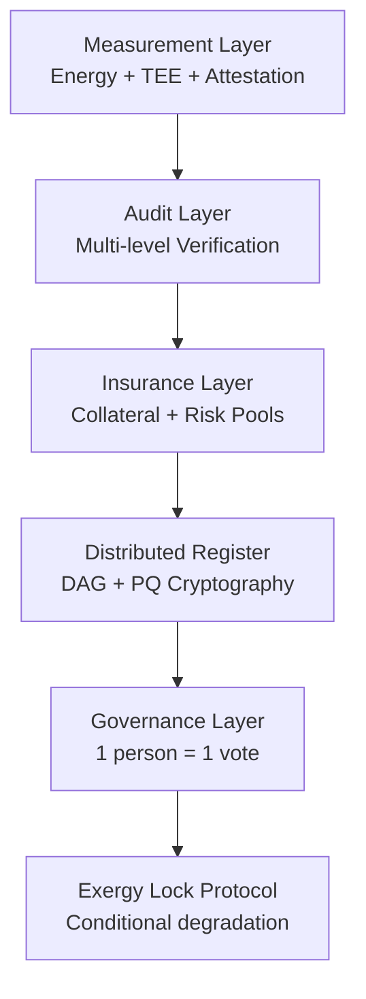

## Safe Compute Exergy (SCE)

Author: Institut Mariani / C.O.R.S.I.C.A. · Corte, Corse, France
Jean Hugues Noël Robert, baron Mariani

Repository: [https://github.com/JeanHuguesRobert/marenostrum](https://github.com/JeanHuguesRobert/marenostrum)
License: CC BY-SA 4.0

---

## TL;DR

AI constraints have shifted from model scale to **contextualized energy and infrastructure-bound compute**. Safe Compute Exergy (SCE) defines a measurable and auditable abstraction layer for useful compute through the CXU (Compute eXergy Unit), which integrates energy, hardware efficiency, system losses, SLA, and traceability.

SCE is not a system optimized for epistemic truth. It is a **socio-technical infrastructure for democratic arbitration of computational scarcity under irreversible uncertainty**.

Its foundational axiom is normative: **sovereign democratic governance (1 person = 1 voice) is the final arbitrator of compute infrastructure, even under partial or imperfect technical knowledge.**

---

## Reader’s Note

This document formalizes an intuition emerging from the dialogue “Photons to Inferences” (April 2026) and extends:

* Mediterranean Exergy Charter
* infrastructure_is_all_you_need.md

It is designed as an open design artifact (“design in the open”). Traceability is structural, not optional.

---

## 1. The Problem

### 1.1 Shift of the bottleneck

The AI bottleneck is no longer primarily model size but:

* localized electrical availability
* temporal energy distribution
* infrastructure latency constraints
* system-level efficiency of inference execution

AI has become an **electro-infrastructural industry**.

The core constraint is no longer silicon, but **contextualized usable energy**.

---

### 1.2 Limits of current regulatory frameworks

Current frameworks (e.g. EU AI Act, US state-level compute thresholds) rely on:

* fixed FLOP thresholds
* model-centric definitions of risk
* static compliance criteria

Limitations:

* ignore inference economics
* ignore energy locality
* ignore system efficiency variance
* create loopholes via relocation or optimization arbitrage

---

### 1.3 Existing crypto-AI systems

Existing approaches (e.g. compute marketplaces, decentralized GPU networks) generally:

* tokenize raw compute capacity
* ignore verified usefulness of compute
* lack unified notion of quality-adjusted inference output

SCE defines a missing layer: **useful, verifiable compute under real-world constraints**.

---

## 2. Foundational Concept: From Energy to Exergy

### 2.1 Definition

Compute exergy is the fraction of available energy convertible into useful inference under real operational constraints.

It extends thermodynamic exergy into computational systems.

---

### 2.2 Operational formulation

[
Xc = E \times \eta_{hw} \times \eta_{sys} \times \eta_{sla} \times \eta_{traceability}
]

Where:

* **E**: contextualized energy (location, time, carbon mix)
* **η_hw**: hardware efficiency
* **η_sys**: system-level losses (cooling, orchestration, networking)
* **η_sla**: service quality (latency, uptime, priority class)
* **η_traceability**: auditability and verifiability

Key property:

> opaque or non-auditable compute collapses toward zero exergy by design.

---

### 2.3 Two-layer interpretation

* Xc_phys: physical corrected energy representation
* CXU: functional unit of verified useful inference capacity

CXU is not energy. It is **conventionalized usable compute under governance rules**.

---

## 3. CXU (Compute eXergy Unit)

### 3.1 Definition

1 CXU corresponds to a standardized ability to produce a defined number of reference inferences under a fixed SLA and execution environment.

---

### 3.2 Reference inference (v1)

To be standardized in `reference_inference_v1.md`:

* Model: frozen open-weight reference model (versioned)
* Output: 1,000 tokens
* Constraint: latency ≤ 200 ms (P95)
* Execution: canonical runtime specification

This reference is a **governed convention**, not a natural constant.

---

### 3.3 Market tiers

* Tier 1 — Critical: real-time infrastructure (medical, industrial, legal)
* Tier 2 — Standard: general-purpose agentic workloads
* Tier 3 — Opportunistic: surplus energy / batch compute

---

## 4. System Architecture

Flux principal:

**MEASUREMENT → AUDIT → INSURANCE → REGISTER → GOVERNANCE**

---

### Components

* **Measurement layer**: TEE, certified metering, model hashing, attestation
* **Audit layer**: multi-level verification (0.00 → 1.00)
* **Insurance layer**: collateralization, mutual pools, parametric insurance
* **Register layer**: DAG-based distributed ledger, post-quantum cryptography
* **Governance layer**: democratic arbitration system

---

---

## 5. Sovereign Risk: Exergy Lock Protocol

Three levels:

1. Cryptographic control of execution rights
2. Performance degradation of compute efficiency
3. Migration of workloads to alternative zones

Conditions of activation are:

* predefined
* multi-party verifiable
* publicly auditable

---

## 6. Governance (Core Axiom)

### 6.1 Foundational axiom

SCE is grounded on a non-technical axiom:

> **One person = one voice is the final arbitration mechanism of the system.**

This is not derived from efficiency considerations. It is a **normative postulate of sovereignty**.

---

### 6.2 Separation of layers

The system explicitly separates:

* operational compute layer (automatic execution)
* technical mediation layer (auditable expertise)
* political layer (democratic arbitration)

---

### 6.3 Status of governance decisions

Governance does not guarantee technical truth.

It guarantees:

* final closure of uncertainty
* legitimacy of arbitrated outcomes
* revisability of system rules over time

---

### 6.4 Epistemic limitation (explicitly accepted)

The system assumes:

* technical measurements may be incomplete
* representations may be imperfect
* decisions may diverge from physical optima

This divergence is not a failure condition. It is an accepted property of democratic closure.

---

### 6.5 Boundary condition

Criticism is structured as follows:

* critique of implementation → internal system process
* critique of democratic principle → external axiomatic disagreement

The system integrates the first and identifies the second as a distinct political stance external to SCE.

---

## 7. Integration into MareNostrum

SCE extends the Mediterranean Exergy Charter into a compute governance layer.

Applications:

* sovereign compute issuance via energy infrastructure
* regional compute markets (Mediterranean zone)
* traceable export of verified compute capacity

A fraction of CXU issuance is allocated to independent AI safety research funding.

---

## 8. Use Cases

* sovereign compute markets
* regulated AI infrastructure coordination
* energy-to-compute conversion economies
* transparent allocation of constrained inference capacity
* funding of AI safety research via usage-based mechanisms

---

## 9. Known gaps and limitations

Acknowledged as structural:

* identity and Sybil resistance
* benchmark governance and drift
* oracle problem in inference equivalence
* network latency modeling
* interaction with existing state systems
* tension between democracy and technical opacity

These are not blocking issues; they are intrinsic properties of the model.

---

## 10. Next Steps

### Short term

* formal CXU definition function
* reference inference specification
* insurance contract templates

### Medium term

* Exergy Lock Protocol formalization
* register specification (post-quantum)
* benchmark governance system

### Long term

* full constitutional governance layer
* multi-zone deployment (MareNostrum region)
* academic publication: “Exergy Analysis Applied to AI Compute”

---

## Appendix A — Glossary

* **CXU**: unit of verified useful compute under SLA and governance
* **Compute exergy (Xc)**: efficiency-adjusted physical compute potential
* **η_traceability**: auditability coefficient (nullity condition if zero)
* **Exergy Lock Protocol**: graduated control mechanism over compute availability
* **SCE**: socio-technical system for democratic arbitration of compute scarcity

---

Living document — iterative public versions maintained in the MareNostrum repository.
